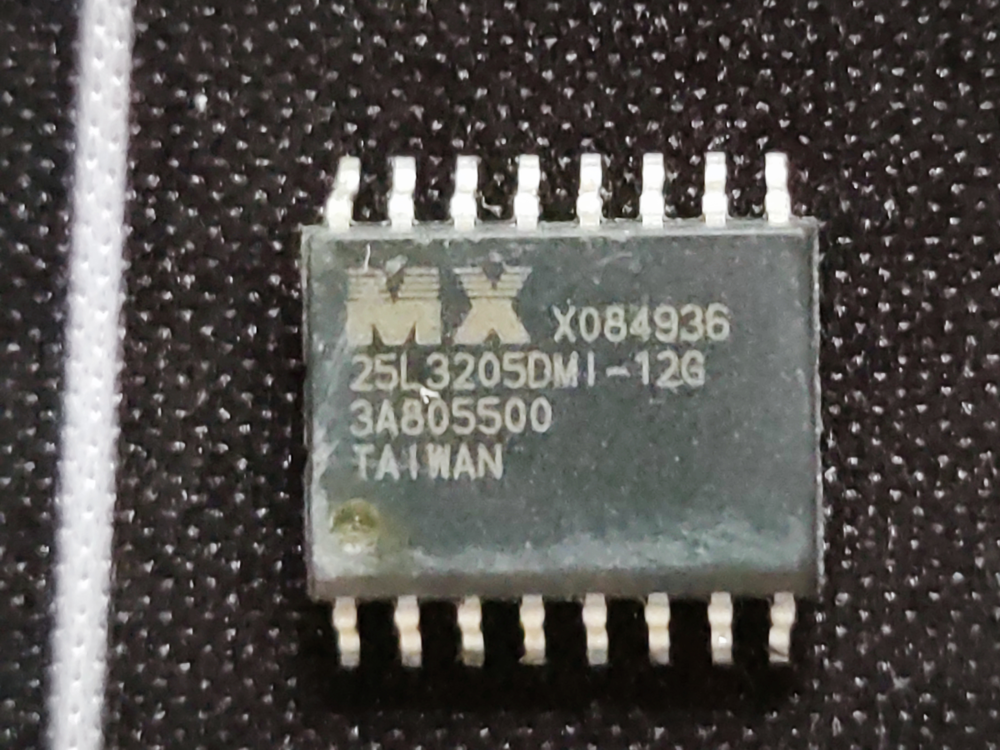
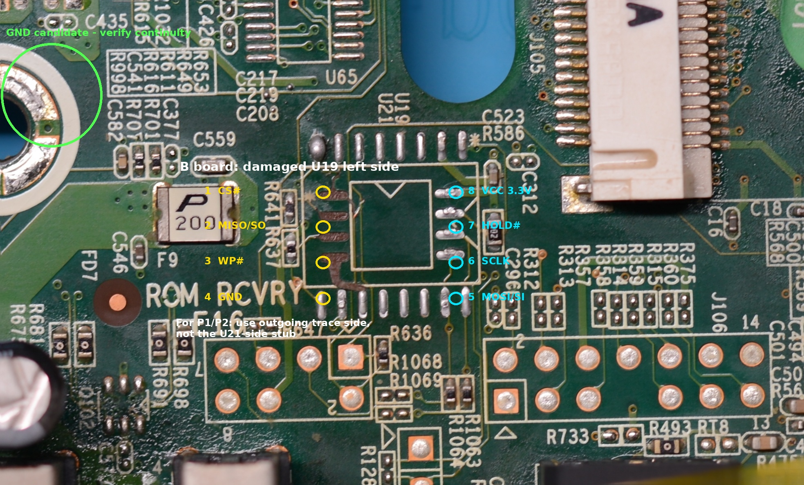
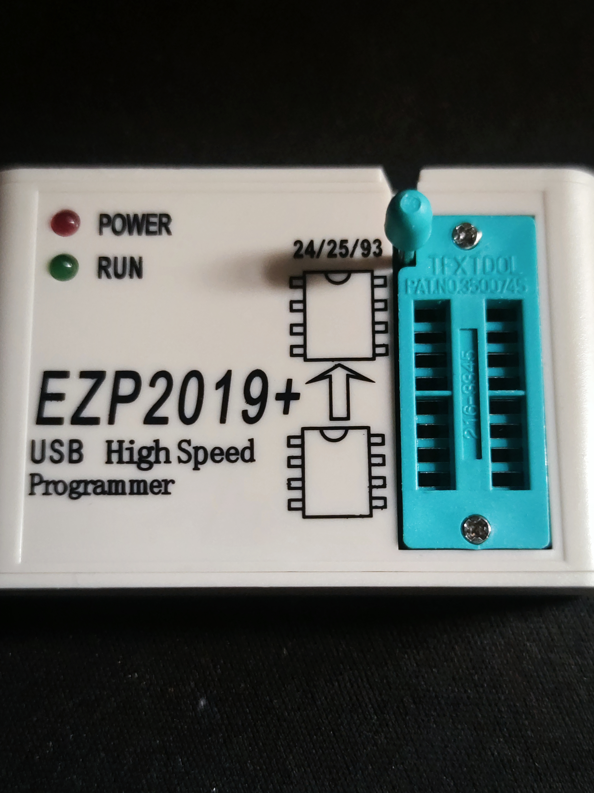
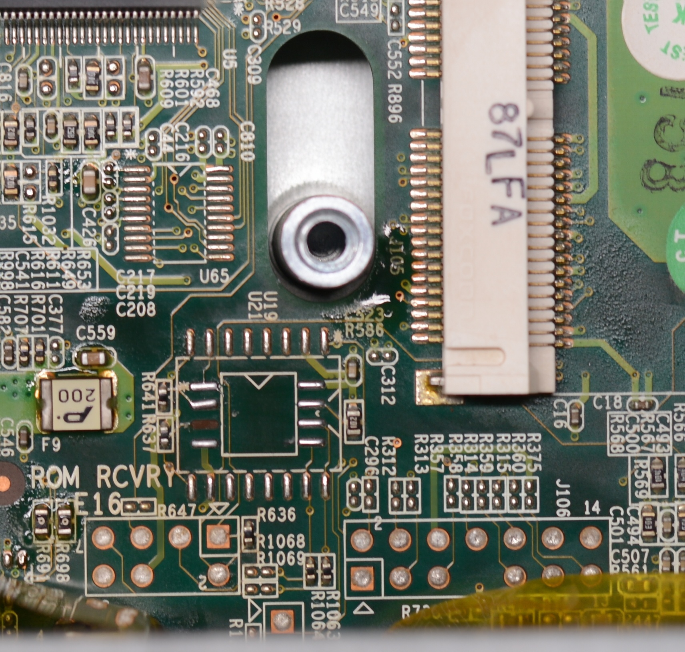
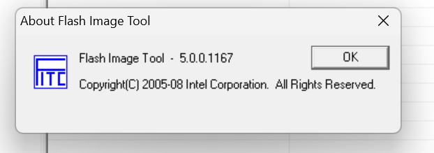
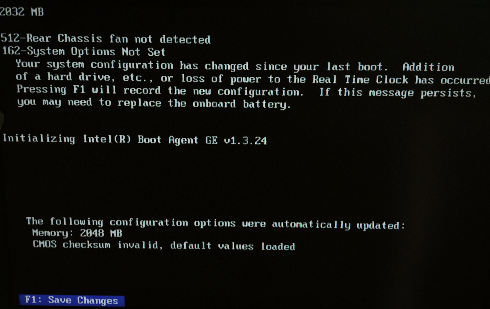
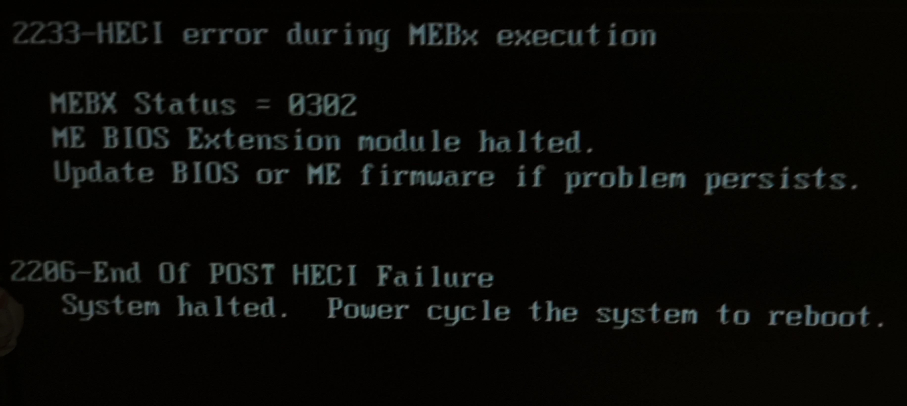
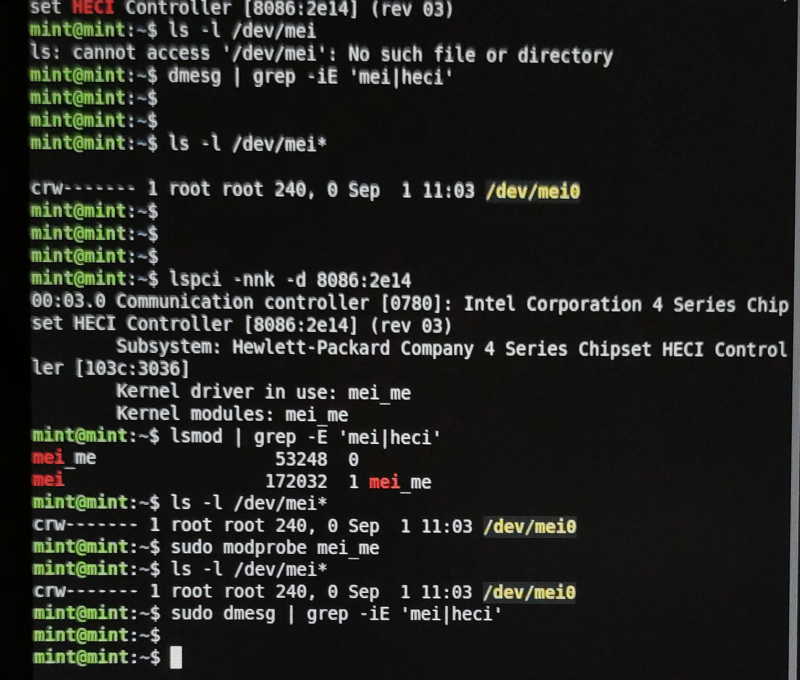
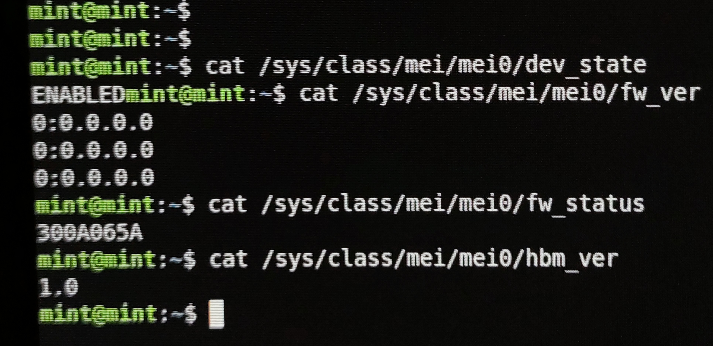

# HP Compaq dc7900 USDT POST Freeze / Intel ME Recovery — Full Technical Report

[Documentation index](README.md) | [中文完整报告](full-report-zh-CN.md) | [Image evidence archive](../images/README.md)

> **Project period:** 2026-08-19 — 2026-09-02  
> **Document version:** 1.0 / final project report  
> **Final status:** both Machine A and Machine B recovered
>
> Both systems can now complete POST, enter F10 BIOS Setup, and boot an operating system. The original POST freeze has not returned during subsequent observation, and the transient 2233 / 2206 MEI / HECI errors have not reappeared.
>
> **Public-version privacy note:** machine-specific or linkable identifiers have been redacted. Full MAC addresses, serial numbers, Product / SKU values, and similar identifiers are not published. Firmware versions, chip models, offsets, and technical hashes are retained unless they would reveal machine-specific data.

---

## Core conclusion

This project investigated two HP Compaq dc7900 Ultra-Slim Desktop systems with the same characteristic failure:

> POST and memory counting complete, F10 is recognized and `SETUP` appears, but the machine freezes before BIOS Setup can actually open and cannot continue normal boot.

Through repeated SPI acquisition, binary comparison, controlled single-variable firmware experiments, board-level repair, and final Linux validation, the evidence points to:

**corruption or invalid persistent configuration / state inside the Intel ME 5.x Region, especially around EFFS / NVAR / OEM configuration.**

The direct experiments also ruled out the following as the primary cause of the original failure:

- random corruption of the main System BIOS body;
- simply running an older BIOS revision;
- Intel ME executable CODE / NFTP alone;
- a failed physical HECI controller.

The validated recovery principle is:

1. preserve the target machine's Flash Descriptor;
2. preserve the target machine's GbE NVM / MAC;
3. preserve the target machine's PDR;
4. preserve the target machine's BIOS runtime / DMI / serial / UUID data;
5. replace the complete failing Intel ME Region with a healthy HP OEM ME Region;
6. use the official HP BIOS v1.27 System BIOS body.

The report follows:

**symptom → acquisition → exclusion → root cause → recovery → validation → SOP**

Only failed paths that materially help explain the evidence chain are retained.

---

# 1. Systems, original failure, and final diagnosis

## 1.1 The two systems and their common original symptom

The project covered two:

**HP Compaq dc7900 Ultra-Slim Desktop (USDT)**

BIOS family:

```text
786G1
```

Before any large-scale soldering or firmware experimentation, both machines behaved almost identically:

1. the machine powered on and displayed POST;
2. memory counting completed normally;
3. pressing F10 early caused `SETUP` to appear in the lower-right corner;
4. the system then froze permanently on that screen;
5. BIOS Setup never actually opened;
6. the operating system could not boot normally.

The screen appeared to stop near the end of memory counting, but the final experiments showed that:

**memory testing itself was not the failure.**

The memory-count display was simply the last UI state successfully drawn before a later platform-initialization deadlock.

---

## 1.2 How Machine A and Machine B diverged during repair

The original failure was the same, but different secondary faults were introduced during the repair process.

### Machine B

Original state:

```text
POST reaches a fixed late stage
F10 -> SETUP
cannot enter Setup
```

After repeated desoldering, B suffered:

```text
U19 left-side pads, Pin 1–4, detached
```

The SPI network was later restored using:

- the alternative U21 SOP16 footprint;
- fly-wires;
- a 16-pin SPI Flash.

Machine B became the main **causal-isolation test platform** for the project.

### Machine A

A originally had the same failure as B:

```text
POST freeze
F10 -> SETUP
cannot enter Setup
```

After extensive disassembly and reassembly, A later developed a separate symptom:

```text
black screen
no normal POST
fan at high speed
```

A also lost:

```text
U19 Pin 3 / WP# pad
```

The black-screen condition was eventually traced to an independent:

**CPU / socket contact problem.**

After cleaning CPU contacts and the socket, and then using the firmware route already validated on B, A recovered POST.

---

## 1.3 Final root-cause conclusion and evidence boundary

### Directly demonstrated

The original symptom:

```text
POST freeze
F10 displays SETUP
Setup never opens
```

was directly caused by the target machine's original **Intel ME Region content / persistent state**.

Machine B immediately crossed the previously impassable POST point after:

```text
complete replacement with a healthy HP OEM ME Region
```

After the independent CPU / socket issue was removed, Machine A recovered by the same healthy-ME route.

### Strongly supported

The failure is concentrated in:

```text
persistent configuration / state
EFFS
NVAR
OEM configuration
```

rather than the executable:

```text
ME CODE
NFTP
```

The main evidence is:

- replacing only the System BIOS body with v1.27 did not change the failure;
- replacing only ME CODE / NFTP with 5.2.50.1039 did not change the failure;
- FITC reported on the failing image:

```text
ME_CFG_DEF NVAR Not found.
```

- the same FITC version could parse HP's healthy OEM ME configuration;
- complete HP OEM ME replacement eliminated the freeze.

### Not demonstrated

This project did **not** replace every NVAR individually, so it cannot claim that one exact NVAR or a specific fixed set of bytes has been isolated as the unique trigger.

The project also used only two physical machines. It therefore does not claim that every dc7900 with a superficially similar freeze has exactly the same root cause.

---

# 2. dc7900 SPI / ME architecture and board service interfaces

## 2.1 Confirmed 4 MiB SPI layout

Complete SPI size:

```text
4,194,304 bytes
0x000000–0x3FFFFF
```

Confirmed layout:

| Region | Address range | Size | Recovery policy |
|---|---:|---:|---|
| Flash Descriptor | `0x000000–0x000FFF` | 4 KiB | preserve target original |
| GbE NVM | `0x001000–0x002FFF` | 8 KiB | preserve target MAC / NVM |
| PDR | `0x003000–0x00AFFF` | 32 KiB | preserve target original |
| Intel ME | `0x00B000–0x25FFFF` | `0x255000` bytes | replace with healthy HP OEM ME |
| BIOS runtime / DMI | `0x260000–0x261FFF` | 8 KiB | preserve target identity / runtime data |
| System BIOS body | `0x262000–0x3FFFFF` | `0x19E000` bytes | use official HP BIOS v1.27 body |

Descriptor signature:

```text
5A A5 F0 0F
```

The GbE NVM on both machines passed the:

```text
0xBABA
```

checksum validation.

The final repair must therefore not overwrite the target machine's:

- Descriptor;
- MAC;
- GbE NVM;
- DMI;
- serial number;
- Product information;
- UUID.

---

## 2.2 HP service jumpers and project baseline

According to the dc7900 board service designations used during the project:

```text
E1       Descriptor table override header
E14      SPI ROM boot block header
E49/JP49 Password clear header / jumper
```

The project also used:

```text
SW50     Clear CMOS
```

Final normal baseline:

| Item | Normal state | Purpose |
|---|---|---|
| E49 / JP49 | pins 1–2 | normal operation |
| E1 | open | Descriptor override; not shorted in normal operation |
| E14 | open | SPI ROM Boot Block; not shorted in normal operation |
| SW50 | operate only with AC removed and battery removed | Clear CMOS |
| CR2032 | installed | RTC / CMOS |

CMOS-clear procedure used in the project:

```text
disconnect AC
remove CMOS battery
hold SW50 for about 10 seconds
```

### Historical correction

During early troubleshooting, several jumpers had been moved under other guidance.

Therefore the later physical position of a jumper cap could no longer be used to infer the factory baseline.

The project re-established the baseline from HP technical information:

```text
E49 1–2
E1 open
E14 open
```

---

# 3. Why ordinary BIOS / recovery procedures did not solve it

Before direct SPI analysis, both machines went through many conventional recovery attempts, including:

- Boot Block;
- FDO-related experiments;
- Win+B;
- USB Recovery;
- jumper combinations;
- CMOS clear;
- ordinary BIOS update;
- BIOS Recovery variants.

The useful conclusion from these attempts is not that any one of them was "almost successful."

It is that:

**normal System BIOS flashing paths did not touch the persistent ME state that was actually failing.**

HP SP54033 provides:

```text
786G1 BIOS v1.26 Rev.A
2011-07-25
```

with conventional BIOS update / recovery mechanisms.

Those procedures primarily target the System BIOS.

The final fault, however, was inside:

```text
Intel ME Region persistent state
```

Therefore, when a machine presents the same strongly matching symptom, endless repetition of:

```text
HPQFlash
Boot Block
USB Recovery
CMOS clear
```

is low-value.

The investigation should move earlier to:

```text
complete SPI dump
↓
region analysis
↓
ME Region comparison
```

---

# 4. SPI chip identification, acquisition baseline, and programmer reliability

## 4.1 U19 and U21

The board provides:

```text
U19 SOIC8
U21 SOP16
```

as compatible / alternative SPI Flash footprints.

The original Flash belongs to the:

**Macronix MX25L3205D family**

with:

```text
32 Mbit
4 MiB
3.3 V
```

A successfully used replacement was:

```text
MX25L3205DMI-12G
SOP16
4 MiB
3.3 V
```



*Figure 1 — Macronix MX25L3205DMI-12G SOP16 SPI Flash used in the project.*

---

## 4.2 U19 ↔ U21 signal mapping

Confirmed mapping:

| U19 SOIC8 | Signal | U21 SOP16 |
|---:|---|---:|
| 1 | CS# | 7 |
| 2 | SO / MISO | 8 |
| 3 | WP# | 9 |
| 4 | GND | 10 |
| 5 | SI / MOSI | 15 |
| 6 | SCLK | 16 |
| 7 | HOLD# | 1 |
| 8 | VCC 3.3 V | 2 |

SOP16 pins:

```text
3–6
11–14
```

are NC for this mapping.

This mapping became essential after B lost the U19 pads.



*Figure 4 — Annotated B-board U19 / U21 signal map for CS#, MISO, WP#, and GND.*

---

## 4.3 Three identical dumps before trusting a baseline

Machine A was read as:

```text
SPI_A_1.bin
SPI_A_2.bin
SPI_A_3.bin
```

Each file was:

```text
4,194,304 bytes
```

and all three were byte-for-byte identical.

A original SHA-256:

```text
209577D93CA7B70DE336864A4B771499C7234318955B9C5F1571697E9B9991E4
```

A original MD5:

```text
DA0E898F5831D4521F15A1A1B285AF5E
```

Machine B was similarly read as:

```text
SPI_B_1.bin
SPI_B_2.bin
SPI_B_3.bin
```

and the three reads were also identical.

B original SHA-256:

```text
70B3A1229420AE9FB7363B2A96C9B4C506EA1CCE5D8A8B266DE2A012B80DB967
```

B original MD5:

```text
968737F068528F86324618A35CC8C25C
```

### Why this mattered

One apparently successful read is not enough.

The project rule was:

```text
Read
Read
Read
↓
SHA-256 identical
```

Only after this can a later binary difference reasonably be interpreted as firmware content rather than clip contact, power instability, or communication noise.

---

## 4.4 EZP2019+ and the Windows 11 host trap

The main programmer was:

```text
EZP2019+
```



*Figure 2 — EZP2019+ used for offline read, erase, program, and read-back validation.*

On one Windows 11 host:

- chip ID could be detected;
- reads worked;
- Page Program could even write all-zero data;
- Erase stopped after only a few progress steps;
- the chip was only partially erased;
- the RUN LED could stay abnormally lit;
- software could report the programmer disconnected.

An:

```text
EZP2023 V3.0
```

was later tested on the same Windows 11 host and exhibited a similar erase problem.

However, moving the same EZP2019+, chip, and adapter to another Windows 10 machine immediately restored:

```text
Erase
Write
Read Back
```

to normal operation.

The final project conclusion was therefore not "EZP2019 is incompatible with Windows 11" in general.

It was:

> one specific Windows 11 host environment had a USB / driver / power / software interaction that made erase unreliable.

Windows 10 became the verified programming host for this project.

### Test files

4 MiB all-zero file:

```text
MX25L3205D_4MB_ALL_ZERO_TEST.bin
```

SHA-256:

```text
BB9F8DF61474D25E71FA00722318CD387396CA1736605E1248821CC0DE3D3AF8
```

A 1 MiB test pattern:

```text
MX25L8005E_1MB_TEST_PATTERN.bin
```

SHA-256:

```text
FBBAB289F7F94B25736C58BE46A994C441FD02552CC6022352E3D86D2FAB7C83
```

These were used only to isolate basic programmer / flash write-path behavior.

---

# 5. Pad damage and U19 / U21 hardware recovery

## 5.1 Machine B: U19 left-side pads 1–4 detached

B lost:

```text
U19 Pin1
U19 Pin2
U19 Pin3
U19 Pin4
```

corresponding to:

```text
Pin1 CS#
Pin2 MISO
Pin3 WP#
Pin4 GND
```


*Figure 3 — Machine B U19 / U21 area. U19 left-side pads Pin 1–4 are detached.*

A crucial PCB-level finding was that some U21-side signals did not simply bypass the damaged U19 area and independently continue to the chipset.

Some networks still passed through:

```text
U19 pad / nearby trace
```

before reaching the downstream circuit.

Therefore:

> soldering an SOP16 Flash to U21 alone does not necessarily bypass a broken U19 network.

Final repair approach:

### Pin 1 / CS#

Connect to the:

```text
actual downstream CS# network
```

not merely a residual U21-side stub.

### Pin 2 / MISO

Likewise reconnect to the true downstream data network.

### Pin 3 / WP#

It is not necessary to reconstruct the original broken trace if WP# is deliberately held high.

A practical repair is:

```text
approximately 4.7–10 kΩ
pull-up to 3.3 V
```

to prevent WP# from floating.

### Pin 4 / GND

Connect to a nearby ground point verified with a multimeter.

### Pin 5–8

The original U19 pads remained intact and continued to use the existing PCB network.

This:

```text
U21 SOP16 + fly-wire
```

arrangement ultimately restored reliable SPI access on B.

For repeated firmware experimentation, it was also more serviceable than repeatedly removing an SOIC8 device.

---

## 5.2 Machine A: only U19 Pin 3 / WP# pad detached

A's principal pad damage was:

```text
U19 Pin3 / WP#
```



*Figure 5 — Machine A U19 / U21 area. The main damage is U19 Pin 3 / WP#.*

WP# is not part of the normal SPI read data path.

As long as it is:

```text
held stably high
```

the loss of the WP# pad alone should not produce:

```text
complete black screen
fan at full speed
```

The later discovery of A's CPU / socket contact issue confirmed this reasoning.

---

# 6. Structured forensics of the original SPI images

## 6.1 Machine identity and NVM

| Item | Machine A | Machine B |
|---|---|---|
| MAC | `00:22:64:XX:XX:XX` | `00:23:7D:XX:XX:XX` |
| GbE NVM checksum | `0xBABA` | `0xBABA` |
| Product | `FX808PA#***` | `KP722**` |
| Serial | `JPA84*****` | `JPA90*****` |
| Model | HP Compaq dc7900 Ultra-Slim Desktop | HP Compaq dc7900 Ultra-Slim Desktop |

This immediately established that B's full 4 MiB image must not be permanently used on A.

Likewise, a generic HP full 4 MiB image should not simply overwrite any target dc7900.

A correct repair preserves the target machine's:

```text
Descriptor
GbE / MAC
PDR
BIOS runtime / DMI
```

---

## 6.2 Evidence excluding the System BIOS body

The B original SPI range:

```text
0x262000–0x3FFFFF
```

matched the official HP 1.26 System BIOS body:

```text
byte-for-byte
```

This is strong negative evidence against random corruption of the main System BIOS body.

A and B also had matching static System BIOS body content.

Differences were concentrated mainly in:

```text
BIOS first 8 KiB
0x260000–0x261FFF
```

and writable ME state.

These areas are expected to contain:

- runtime records;
- machine-specific data;
- persistent state.

Historical analysis of B's two 4 KiB BIOS runtime blocks found only:

```text
2 bytes difference
```

while each 4 KiB block retained a zero byte-sum checksum.

That pattern is more consistent with:

```text
redundant records with generation / checksum semantics
```

than with random bit rot.

---

## 6.3 The critical relationship between HP BIOS 1.26 and 1.27

An early hypothesis was:

> BIOS 1.27 might also contain an ME update.

Direct binary comparison later proved this wrong.

HP official:

```text
1.26
1.27
```

contain an:

```text
identical ME Region
```

The important differences are in the:

```text
System BIOS body
```

Therefore B's eventual recovery cannot be explained as:

> "BIOS 1.27 updated ME."

Extracted official HP 1.26 full ROM:

```text
HP_786G1_v01.26_OFFICIAL_Rom.bin
```

SHA-256:

```text
EAC16981A32DBFDC312B3C12597522F4520D5A7D16BE4F3422F2983A2652EDAF
```

MD5:

```text
09B5628F42134F0C5F28702C9F3B56C7
```

---

# 7. Machine B controlled exclusion experiments

Machine B carried the most important single-variable causal tests.

## 7.1 Original baseline

Image:

```text
SPI_B_1.bin
```

Result:

```text
POST freezes at the fixed point
F10 -> SETUP
still frozen
```

This established a repeatable failure baseline.

---

## 7.2 The abandoned V2 route

An early image replaced several large areas at once:

```text
PDR
ME
BIOS
```

Result:

```text
B black screen
```

Too many variables changed, so the experiment could not isolate causality.

Flashing back:

```text
SPI_B_1.bin
```

restored the exact original:

```text
POST freeze
```

The failed experiment still demonstrated:

- the chip could be repeatedly programmed;
- the board SPI path could be restored;
- external programming was controllable;
- later single-variable tests were meaningful.

### Do not use

```text
DC7900_A_127_CLEAN_TEST_V2.bin
DC7900_B_127_CLEAN_TEST_V2.bin
```

These belong to an abandoned experimental route.

---

## 7.3 BIOS-only v1.27 — System BIOS body excluded

Image:

```text
DC7900_B_v1.27_VALIDATED_BIOS_ONLY.bin
```

Structure:

```text
0x000000–0x261FFF
preserve B original

0x262000–0x3FFFFF
replace with official HP BIOS v1.27 body
```

SHA-256:

```text
5357E612C21655EBA27D84190343884556CE148C21A7099A37A53D6870B3F3C4
```

MD5:

```text
3F98191396CB3DE8E9735CB0594EA2CC
```

Physical result:

- BIOS displayed v1.27;
- the original freeze point did not move;
- F10 -> SETUP behavior did not change.

Therefore:

**upgrading the System BIOS alone does not repair this fault.**

---

## 7.4 ME CODE / NFTP 5.2.50.1039 — executable ME code excluded

HP package:

```text
SP54355
```

contains:

```text
52501039.BIN
```

Intel `$MAN` headers identify version:

```text
5.2.50.1039
```

B's original CODE / NFTP version:

```text
5.0.1.1111
```

This experiment replaced only:

```text
CODE
NFTP
```

while preserving B's original:

```text
EFFS
runtime
persistent state
```

Historical project partitioning:

| ME subregion | ME-relative range | SPI absolute range | Action |
|---|---:|---:|---|
| EFFS | `0x002000–0x0D1FFF` | `0x00D000–0x0DCFFF` | preserve B |
| CODE | `0x0D2000–0x161FFF` | `0x0DD000–0x16CFFF` | replace with 5.2.50.1039 |
| NFTP | `0x162000–0x241FFF` | `0x16D000–0x24CFFF` | replace with 5.2.50.1039 |
| Tail / Padding | — | `0x24D000–0x25FFFF` | preserve |

> These subregion ranges reflect the project's historical working partitioning and should be rechecked against the actual image map before reuse.

Generated image:

```text
DC7900_B_v1.27_ME_5.2.50.1039_CODE_NFTP_TEST.bin
```

SHA-256:

```text
884CC0F4C2376ED093702D9797B99E74B1DC79136C007311BD72A22BDC5A7903
```

MD5:

```text
D041C15F5E60BEE6F446020186D8F6A3
```

Physical result:

```text
still froze at exactly the same point
```

If the root cause had been executable ME code corruption or an obsolete ME code revision, this replacement should have changed machine behavior.

It did not.

Suspicion therefore concentrated further on:

```text
EFFS
runtime state
persistent configuration
NVAR
```

---

# 8. FITC evidence: missing ME_CFG_DEF NVAR

## 8.1 FITC version and platform

Used:

```text
Intel ME Flash Image Tool
5.0.0.1167
```

Platform Select included:

```text
Boulder Creek - EL ICH10
McCreary - EL ICH10D
```

For the Q45 / ICH10 dc7900, the project used:

```text
Boulder Creek - EL ICH10
```



*Figure 6 — Intel Flash Image Tool 5.0.0.1167 platform selection used for dc7900 analysis.*

---

## 8.2 Key log from the failing B image

FITC Decompose on B / the B127 failure baseline produced messages including:

```text
ME_CFG_DEF NVAR Not found.
KernFixedData NVAR Not found. Adding NVAR.
```

and the decomposed:

```text
Configuration.txt
```

was:

```text
0 bytes
```

This behavior was reproducible on the failing image.

---

## 8.3 Healthy HP image as control

The same FITC version could decompose HP's healthy official image and produce a normal OEM configuration output of roughly 4 KiB.

This control is important.

It means the failing result cannot simply be dismissed as:

> "FITC 5.0.0.1167 cannot understand dc7900 ME5 images at all."

Instead, FITC behaved differently between:

```text
healthy HP OEM ME
```

and:

```text
failing machine ME state
```

The evidence therefore strongly supports a persistent ME configuration / NVAR abnormality.

---

## 8.4 Why FITC Build output was rejected

FITC could successfully complete a Build operation.

However, binary comparison showed that its output changed Descriptor strap-related content.

Therefore:

> **Build success does not equal flash safety.**

FITC was useful as an analysis and decomposition tool in this project, but automatically generated FITC output was not accepted as a final flash image unless every changed region was explicitly understood.

---

# 9. Complete HP OEM ME replacement — decisive recovery

## 9.1 The decisive experiment

After BIOS-only and CODE / NFTP-only replacement had both failed, Machine B was tested with a complete healthy HP OEM ME Region.

The key replacement was:

```text
0x00B000–0x25FFFF
```

while preserving B's own identity-bearing regions.

The System BIOS body was kept at the official HP v1.27 version.

---

## 9.2 First successful crossing of the freeze point

For the first time, B continued past the POST location where it had always frozen.



*Figure 7 — Machine B first crossed the original freeze point after complete healthy HP OEM ME replacement.*

This is the central causal result of the project.

Earlier tests had shown:

```text
System BIOS body replacement
→ no change

ME CODE / NFTP replacement
→ no change

complete healthy HP OEM ME Region
→ freeze eliminated
```

The minimum supported interpretation is therefore:

> the original failure resided in the persistent state / configuration portion of the original ME Region, not in the main BIOS body and not in CODE / NFTP alone.

---

## 9.3 Transient 2233 / 2206 error

During an early boot after the successful ME replacement, B displayed a one-time error including:

```text
2233-HECI error during MEBx execution
MEBX Status = 0302
2206-End Of POST HECI Failure
```



*Figure 8 — one-time 2233 / 2206 error seen during the early post-repair initialization sequence.*

The error did not persist.

After subsequent initialization, CMOS setup, and repeated cold / warm boots, it was not reproduced.

It was therefore treated as a transient first-boot / state-initialization event, not the final fault.

---

# 10. Linux validation of HECI / MEI

After B could boot normally, Linux was used to verify the HECI / MEI chain beyond POST.

Commands included:

```bash
lspci -nnk -d 8086:2e14
lsmod | grep -E 'mei|heci'
ls -l /dev/mei*
cat /sys/class/mei/mei0/dev_state
cat /sys/class/mei/mei0/fw_ver
cat /sys/class/mei/mei0/fw_status
cat /sys/class/mei/mei0/hbm_ver
```

Observed on B:

```text
Intel 4 Series HECI
PCI ID 8086:2e14
rev 03

Subsystem:
HP 103c:3036

Kernel driver:
mei_me

/dev/mei0:
present

dev_state:
ENABLED

fw_status:
300A965A

hbm_ver:
1.0
```



*Figure 9 — Intel 4 Series HECI `[8086:2e14]` enumerated, `mei_me` bound, and `/dev/mei0` present.*

`fw_ver` returned:

```text
0:0.0.0.0
```



*Figure 10 — final Linux MEI sysfs observations, including `dev_state`, `fw_status`, `hbm_ver`, and `fw_ver`.*

For this old ME5 platform and a modern Linux MEI interface, the isolated:

```text
fw_ver = 0:0.0.0.0
```

value is not sufficient evidence that firmware is absent or not running.

The same system simultaneously demonstrated:

- HECI PCI enumeration;
- `mei_me` driver binding;
- `/dev/mei0`;
- `dev_state = ENABLED`;
- readable `fw_status`;
- readable HBM 1.0.

This evidence strongly contradicts the hypothesis of a physically dead ICH10 HECI controller.

The original failure therefore belongs at a higher layer:

```text
ME state
client
configuration
initialization
```

rather than the physical HECI link.

---

# 11. Machine A: second fault and final personalized firmware

## 11.1 Why an early donor test was misleading

A began with the same original POST freeze as B.

After extensive handling, however, it developed:

```text
black screen
no beep
fan at full speed
```

At one point, a Flash that could POST on B, containing B firmware, was installed on A.

A still failed to POST.

At that stage, the experiment reasonably suggested:

> A had acquired an additional board-level problem independent of firmware.

After B had a truly validated healthy image, A was retested only after:

- cleaning the CPU contact pads;
- cleaning the CPU socket.

A then entered the same POST / initialization state seen when B first recovered.

The final explanation is that A contained two independent faults:

### Original fault

```text
ME persistent-state failure
→ POST freeze
```

### Later secondary fault

```text
CPU / socket contact failure
→ black screen + fan full speed
```

Therefore the earlier result:

```text
B donor -> A still black
```

was not evidence against the ME diagnosis.

---

## 11.2 Final personalized image for A

B's successful complete image could be used on A only as a:

```text
diagnostic donor
```

It could not remain permanently because B's:

- MAC;
- serial;
- DMI;
- Descriptor;

belong to B.

A's final image used:

```text
0x000000–0x00AFFF
A original Descriptor + GbE/MAC + PDR

0x00B000–0x25FFFF
validated healthy HP OEM ME from B donor
(effectively HP healthy OEM ME)

0x260000–0x261FFF
A original BIOS runtime / DMI / identity

0x262000–0x3FFFFF
official HP BIOS v1.27 body from the validated donor
```

A original SHA-256:

```text
209577D93CA7B70DE336864A4B771499C7234318955B9C5F1571697E9B9991E4
```

B successful donor SHA-256:

```text
2F42B1A1B12F0D85B8DE4A8546687EBD6A11447AE91FC3FE3E88992EE8927123
```

Final A output:

```text
DC7900_A_FIXED_v1.27_HP_OEM_ME.bin
```

Size:

```text
4,194,304 bytes
```

SHA-256:

```text
8AFDA8295E4CE3325DD3FD409B444655CDE9D4E0F5B3FF8D79CFB301E2978683
```

MD5:

```text
0AC25FEB2BE91CD15814B710D890EB73
```

The build verification also confirmed retention of A-specific identity values, with public redaction:

```text
MAC:
00:22:64:XX:XX:XX

Product:
FX808PA#***

Serial:
JPA84*****

Model:
HP Compaq dc7900 Ultra-Slim Desktop
```

After physical flashing:

**Machine A operated normally.**

The project had now closed the loop on both systems.

---

# 12. Final failure-mechanism model

## 12.1 Minimal failure chain

Based on the two machines:

```text
CPU / memory / early BIOS initialization works
        ↓
POST enters late platform initialization
        ↓
BIOS / MEBx communicates with ME through HECI
        ↓
ME reads / establishes EFFS, NVAR, OEM persistent state
        ↓
failing machine:
critical configuration / state structure is invalid
FITC: ME_CFG_DEF NVAR Not found
        ↓
late ME / BIOS initialization cannot complete
        ↓
screen remains on the last already-drawn memory-count UI state
        ↓
F10 is still captured
SETUP appears
        ↓
but BIOS Setup never actually opens
```

A precise descriptive name is:

> **Intel ME 5.x OEM persistent configuration / EFFS/NVAR corruption induced late-POST initialization deadlock**

or, more generally:

> **late-POST initialization deadlock caused by invalid Intel ME persistent configuration / state**

---

## 12.2 Why this was not simply "bad BIOS"

Because:

1. B's main System BIOS body matched official HP 1.26;
2. replacing only the BIOS body with official 1.27 did not fix the freeze;
3. A and B had the same static BIOS body;
4. complete healthy ME replacement immediately removed the freeze.

Random corruption of the main BIOS program cannot explain the experiment set.

---

## 12.3 Why it was not ME executable CODE

Replacing only:

```text
CODE / NFTP
```

from:

```text
5.0.1.1111
```

to:

```text
5.2.50.1039
```

did not change the symptom.

Therefore neither:

```text
old executable ME version
```

nor:

```text
random executable ME CODE corruption
```

fits the complete evidence.

---

## 12.4 Why it was not the physical HECI controller

After repair, Linux showed:

```text
PCI 8086:2e14
mei_me
/dev/mei0
HBM 1.0
```

Therefore:

```text
ICH10 HECI hardware failure
```

is inconsistent with the observed system.

---

# 13. Why two machines could fail at roughly the same stage of their lifetime

This section is a **high-probability mechanism discussion, not byte-level proof**.

A user not flashing BIOS does not mean the entire SPI has remained static for more than a decade.

The System BIOS body is comparatively static.

ME areas such as:

```text
EFFS
NVAR
persistent configuration
runtime state
```

can change during the platform's lifetime.

The two systems share:

- the same platform;
- the same ME 5.x architecture;
- the same HP OEM configuration family;
- similar production era;
- similar age;
- possibly similar power-loss / startup histories.

If the failure mechanism involves any combination of:

- state accumulation reaching a boundary;
- repeated erase / write of dynamic sectors;
- abnormal NVAR garbage collection;
- interruption of a persistent-state transaction;
- Flash aging;
- an old ME5 state-management edge case;

then same-age systems beginning to fail in the same later-life period is plausible.

Macronix MX25L3205D-family parts are from this generation of Flash.

Typical endurance figures associated with the family include:

```text
100,000 P/E cycles
20-year data retention
```

However, the project does **not** establish:

> "the machine failed simply because 20-year retention expired."

Most other regions remained structurally normal:

- Descriptor;
- main BIOS body;
- most ME executable code;
- GbE NVM.

The abnormality was concentrated much more strongly in the dynamic ME state layer.

Physical aging may therefore be:

```text
one contributing factor
```

but it is not proven as the sole trigger.

---

# 14. Standard recovery SOP for the same confirmed failure mode

## 14.1 Target symptom

Most applicable to dc7900 / 786G1 systems showing:

```text
POST progresses normally
memory count completes
F9/F10/F12 may still be captured
F10 displays SETUP
machine then freezes permanently
Setup never opens
normal boot cannot continue
```

---

## 14.2 Step 0 — restore a standard hardware baseline

1. disconnect AC;
2. restore E49 / JP49 to pins 1–2;
3. leave E1 open;
4. leave E14 open;
5. install a good CR2032;
6. perform a proper CMOS clear;
7. remove unnecessary peripherals;
8. keep only CPU, known-good memory, and basic video.

If the system has changed to:

```text
black screen + fan full speed
```

do not automatically continue treating it as the same ME failure.

Check first:

- CPU / socket;
- power rails;
- reset;
- clock;
- SPI CS#;
- SPI CLK.

---

## 14.3 Step 1 — acquire a trustworthy original dump

1. confirm a compatible 3.3 V / 4 MiB Flash;
2. preferably read it off-board, or use a fully validated ISP setup;
3. perform at least three consecutive reads;
4. do not erase;
5. do not program;
6. each file must be exactly:

```text
4,194,304 bytes
```

7. all SHA-256 values must match;
8. preserve at least two immutable copies of the original evidence image.

---

## 14.4 Step 2 — inspect regions and preserve identity

Confirm:

```text
Descriptor
0x000000–0x000FFF

GbE
0x001000–0x002FFF

PDR
0x003000–0x00AFFF

ME
0x00B000–0x25FFFF

BIOS runtime / DMI
0x260000–0x261FFF

System BIOS body
0x262000–0x3FFFFF
```

Extract and record:

- MAC;
- Product;
- serial number;
- UUID;
- DMI.

Core rule:

> **keep target identity; replace the failing ME state.**

---

## 14.5 Step 3 — construct a "target machine + healthy HP ME" image

Minimal logic:

```python
out = target_original

out[0x00B000:0x260000] = hp_oem_me[0x00B000:0x260000]
out[0x262000:0x400000] = hp_bios_127[0x262000:0x400000]

# all other ranges remain from target_original
```

Equivalent region plan:

```text
000000–00AFFF
preserve target

00B000–25FFFF
healthy HP OEM ME

260000–261FFF
preserve target

262000–3FFFFF
official HP BIOS 1.27
```

If the validated B success image is used as donor, copying those two ranges is equivalent in this project because the donor contains:

```text
ME = healthy HP OEM ME
BIOS body = official HP v1.27
```

---

## 14.6 Step 4 — program and read back

Required process:

```text
Erase
↓
Blank Check
↓
Program
↓
Verify
↓
full Read Back
↓
SHA-256
```

The read-back SHA-256 must exactly match the intended image.

If it does not:

> **do not install / boot the chip.**

### EZP-specific note

If the programmer:

```text
can read
can Page Program
but Erase behaves abnormally
```

do not immediately conclude that the Flash is defective.

This project showed that moving the same hardware from one Windows 11 host to a known-good Windows 10 host completely fixed the erase problem.

---

## 14.7 Step 5 — first boot and stability validation

1. Clear CMOS;
2. restore normal jumpers;
3. perform first boot after complete AC-off;
4. allow expected initialization messages such as:

```text
162
CMOS checksum invalid
defaults loaded
```

5. use F1 / save changes as appropriate;
6. verify that F10 actually enters Setup;
7. enable / use Full Boot if desired;
8. perform at least:

```text
3 warm reboots
+
3 complete AC-off cold boots
```

9. boot Linux Live;
10. perform HECI / MEI validation;
11. only then proceed to the target OS.

The dc7900 is a Legacy BIOS platform.

For Windows installation media, use:

```text
MBR
BIOS / CSM
```

rather than assuming UEFI.

---

## 14.8 If the system is still black — stop making more BIN files

After confirming:

- a known-good, same-platform, physically validated image;
- correct SPI programming and read-back;
- correct 3.3 V;
- non-floating WP#;
- correct jumpers;

if the system still shows:

```text
complete black screen
fan full speed
```

stop generating more firmware images.

Check startup activity on:

```text
SPI Pin1 CS#
SPI Pin6 CLK
SPI Pin2 MISO
```

If:

```text
CS# / CLK show no activity
```

prioritize:

- chipset power;
- reset;
- 32.768 kHz / main clocks;
- straps;
- CPU;
- socket.

Machine A is the direct example of this rule.

---

# 15. BIN / tool / hash reference

## 15.1 Original, experimental, and final images

| File | Size | SHA-256 | Role |
|---|---:|---|---|
| `SPI_A_1.bin` | 4 MiB | `209577D93CA7B70DE336864A4B771499C7234318955B9C5F1571697E9B9991E4` | A original evidence master |
| `SPI_B_1.bin` | 4 MiB | `70B3A1229420AE9FB7363B2A96C9B4C506EA1CCE5D8A8B266DE2A012B80DB967` | B original failure baseline |
| `HP_786G1_v01.26_OFFICIAL_Rom.bin` | 4 MiB | `EAC16981A32DBFDC312B3C12597522F4520D5A7D16BE4F3422F2983A2652EDAF` | official HP 1.26 |
| `DC7900_B_v1.27_VALIDATED_BIOS_ONLY.bin` | 4 MiB | `5357E612C21655EBA27D84190343884556CE148C21A7099A37A53D6870B3F3C4` | BIOS-only test; still freezes |
| `DC7900_B_v1.27_ME_5.2.50.1039_CODE_NFTP_TEST.bin` | 4 MiB | `884CC0F4C2376ED093702D9797B99E74B1DC79136C007311BD72A22BDC5A7903` | CODE/NFTP test; still freezes |
| `DC7900_B_v1.27_HP127_ME_TEMPLATE_ONLY_TEST.bin` | 4 MiB | `2F42B1A1B12F0D85B8DE4A8546687EBD6A11447AE91FC3FE3E88992EE8927123` | B validated success baseline / A donor |
| `DC7900_A_FIXED_v1.27_HP_OEM_ME.bin` | 4 MiB | `8AFDA8295E4CE3325DD3FD409B444655CDE9D4E0F5B3FF8D79CFB301E2978683` | A final successful image |
| `DC7900_B_127_CLEAN_TEST_V2.bin` | 4 MiB | `91EE3D03E1DF23D31515B7E642713BD0DE6591D05D5ADF496DBB7034D07FBE9B` | deprecated |
| `DC7900_A_127_CLEAN_TEST_V2.bin` | 4 MiB | `1A403F5DAB7FD3631FE6BEEBE3A0343C425BCA6A84C70362BB3FE279176AF4DE` | deprecated |

---

## 15.2 SP54355 / ME 5.2.50.1039

`sp54355.exe`

SHA-256:

```text
E713F0358B06FFFDE5AC9A0B807EF1E58054B3AAF03AB5899749DF92905182BD
```

`52501039.BIN`

Size:

```text
1,510,212 bytes
0x170B44
```

SHA-256:

```text
298087A41EDD12013C78CE149F5ECCDECC156FE4238E2C5A75800B2118C43A65
```

Target version:

```text
5.2.50.1039
```

B original CODE / NFTP version:

```text
5.0.1.1111
```

---

## 15.3 Tools and validated environments

| Tool | Version / environment | Project conclusion |
|---|---|---|
| EZP2019+ | Version 2.0 / Windows 10 | final reliable programming environment |
| EZP2023 | V3.0 / original Windows 11 host | showed similar Erase failure |
| Intel Flash Image Tool | 5.0.0.1167 | useful for ME5 decomposition / comparison; Build output not trusted automatically |
| Linux Mint Live | project validation environment | HECI / `mei_me` / OS boot verification |
| Rufus | Legacy installation media | Windows media with MBR + BIOS/CSM |

---

# 16. Deprecated or high-risk items

## Deprecated BIN files

Do not use:

```text
DC7900_A_127_CLEAN_TEST_V2.bin
DC7900_B_127_CLEAN_TEST_V2.bin
```

## FITC automatic Build output

Any FITC:

```text
outimage
```

that changes Descriptor content without a fully explained reason must not be flashed.

## Full overwrite with an HP generic image

Do not blindly write:

```text
7G1_0127.bin
```

from offset:

```text
0x000000
```

across the entire target SPI.

This can destroy:

- Descriptor;
- GbE;
- MAC;
- DMI;
- serial;
- UUID.

## Leaving B's complete image on A

The B donor is valid for:

```text
diagnosis
```

but is not A's permanent identity-correct firmware.

## Interpreting `fw_ver = 0:0.0.0.0`

Do not use only:

```text
/sys/class/mei/mei0/fw_ver
```

showing:

```text
0:0.0.0.0
```

to conclude that ME firmware is missing.

## Repeated desoldering after pad damage

Once pad damage occurs, avoid purposeless repeated removal.

Move to a stable serviceable structure such as:

```text
SOP16 / fly-wire / stable SPI access
```

as early as practical.

---

# 17. Key validation commands

## 17.1 Windows SHA-256

```powershell
Get-FileHash .\SPI_A_1.bin -Algorithm SHA256
Get-FileHash .\SPI_B_1.bin -Algorithm SHA256
Get-FileHash .\DC7900_B_v1.27_HP127_ME_TEMPLATE_ONLY_TEST.bin -Algorithm SHA256
Get-FileHash .\READBACK.bin -Algorithm SHA256
```

Core rule:

> **Even after the programmer reports Verify OK, perform a complete read-back and calculate SHA-256 over the entire file.**

---

## 17.2 Linux HECI / MEI

```bash
lspci -nnk -d 8086:2e14
lsmod | grep -E 'mei|heci'
ls -l /dev/mei*
cat /sys/class/mei/mei0/dev_state
cat /sys/class/mei/mei0/fw_ver
cat /sys/class/mei/mei0/fw_status
cat /sys/class/mei/mei0/hbm_ver
```

Observed on B:

```text
PCI: 8086:2e14 rev03
Subsystem: HP 103c:3036
Kernel driver: mei_me
/dev/mei0: present
dev_state: ENABLED
fw_status: 300A965A
hbm_ver: 1.0
```

---

# 18. Minimal splice logic

The following code illustrates the final image structure only.

It does not replace a formal build script that verifies source hashes and every copied range.

```python
from pathlib import Path

target = bytearray(Path("target_original.bin").read_bytes())
donor = Path(
    "DC7900_B_v1.27_HP127_ME_TEMPLATE_ONLY_TEST.bin"
).read_bytes()

assert len(target) == len(donor) == 0x400000

target[0x00B000:0x260000] = donor[0x00B000:0x260000]
target[0x262000:0x400000] = donor[0x262000:0x400000]

Path("target_fixed.bin").write_bytes(target)
```

---

# 19. Final A build script and validation

The final A builder did not select source files by filename alone.

It identified required inputs by:

```text
SHA-256
```

Required A original:

```text
209577D93CA7B70DE336864A4B771499C7234318955B9C5F1571697E9B9991E4
```

Required B validated donor:

```text
2F42B1A1B12F0D85B8DE4A8546687EBD6A11447AE91FC3FE3E88992EE8927123
```

The final script performed byte-range provenance checks:

```text
[PASS] 000000-00AFFF = A original Descriptor/GbE/PDR
[PASS] 00B000-25FFFF = B validated HP OEM ME
[PASS] 260000-261FFF = A original runtime/DMI
[PASS] 262000-3FFFFF = B validated BIOS v1.27 body

[PASS] A GbE MAC retained: 00:22:64:XX:XX:XX
[PASS] Identity retained: FX808PA#***
[PASS] Identity retained: JPA84*****
[PASS] Identity retained: HP Compaq dc7900 Ultra-Slim Desktop
```

Final output:

```text
[SUCCESS] FINAL IMAGE BUILT AND VERIFIED
```

Output file:

```text
DC7900_A_FIXED_v1.27_HP_OEM_ME.bin
```

SHA-256:

```text
8AFDA8295E4CE3325DD3FD409B444655CDE9D4E0F5B3FF8D79CFB301E2978683
```

---

# 20. Evidence levels

To avoid turning inference into fact, the project separates three levels of evidence.

## A — directly supported by physical experiments

Examples:

- BIOS-only 1.27 still froze;
- ME CODE / NFTP replacement still froze;
- complete HP OEM ME replacement recovered B;
- A recovered by the same route after removing the CPU-contact fault;
- Linux HECI / MEI communication worked.

## B — strongly supported by multiple independent observations

For example:

```text
EFFS / NVAR / OEM configuration
```

as the core failure area.

The project did not isolate every NVAR at forensic granularity, but:

- FITC behavior;
- single-variable experiments;
- complete ME replacement;
- repeatability across two machines;

all converge on the same layer.

## C — plausible mechanism explanation

For example:

> why several same-age dc7900 systems might begin exhibiting the same failure many years later.

Possible contributors include:

- Flash aging;
- NVAR accumulation;
- garbage collection;
- interrupted persistent transactions;
- ME5 edge conditions.

No evidence in this project identifies one of those as the unique trigger.

---

# 21. Remaining research questions

The repair itself is complete.

Further low-level reverse engineering could investigate:

1. why `ME_CFG_DEF` becomes unparseable in the failing image;
2. which NVAR object is the minimum trigger for the POST deadlock;
3. whether EFFS contains a repeatable corruption pattern;
4. whether the A and B failing ME Regions share the same abnormal byte pattern;
5. whether aging Flash is merely background risk or part of the state failure;
6. whether additional dc7900 dumps can provide third and fourth samples;
7. whether only the persistent ME state can be rebuilt without replacing the entire OEM ME Region.

Those questions belong to:

```text
ME5 firmware forensic analysis
```

rather than the minimum work required to repair the machine.

---

# 22. Final conclusion

The same original failure on two HP Compaq dc7900 systems was ultimately repaired by the same principle:

```text
preserve the target machine identity regions
+
replace with a healthy HP OEM ME Region
+
use the official HP System BIOS v1.27 body
```

Machine B established the main causal evidence chain:

```text
System BIOS body
→ excluded

ME executable CODE/NFTP
→ excluded

ME persistent state
→ strongly isolated

complete HP OEM ME
→ recovery
```

Machine A further demonstrated that the same ME-state failure can coexist with a completely separate:

```text
CPU / socket contact fault
```

introduced later in the repair process.

Therefore:

**two systems beginning with the same symptom does not mean every later symptom created during repair still has the same root cause.**

At the repair level, the project is complete.

The remaining question is no longer:

> can the machines be recovered?

It is:

> can the minimum failing object inside ME5 EFFS / NVAR be isolated precisely?

---

## Project status

**COMPLETED / VALIDATED ON TWO MACHINES**

```text
Machine B:
Recovered

Machine A:
Recovered

F10 BIOS Setup:
Working

Operating system boot:
Working

Original POST freeze:
Not reproduced after repair

2233 / 2206:
Not reproduced during subsequent observation
```
